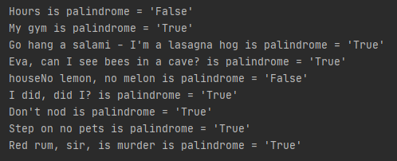

### Palindrome checker using Deques.
#### **Deque**: is an ordered collection of items. Each item can be added/removed from either the front or the rear of the deque.

---
#### Algorithm:
- [x] remove punctuations from the sentence by using regular expression to match only strings, i.e (a-zA-Z0-9).  
- [x] create a deque object.
- [x] add each character through the end of the deque.  (end -->[r, e, f, e, r]<-- front)
- [x] using a while loop, compare the end and the front character by removing items through the end and the front of the deque.
- [x] end iteration when the end character does not equal the front character.

---

